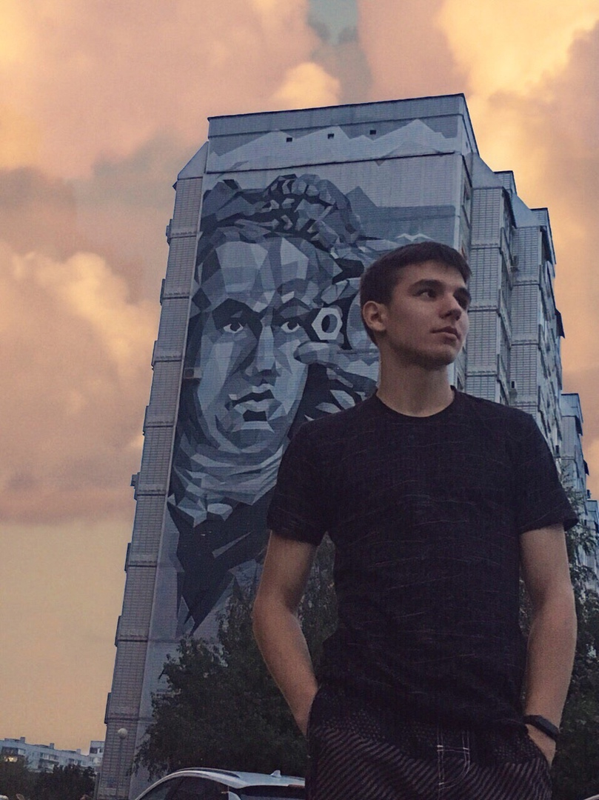

# My CV 2020

## Personal information



**Name:** David Boltuev  
**Address:** Russia, Togliatti.  
**Phone:** +7-996-731-74-41

**Email:** boltuev01@mail.ru

## About me

I'm a frontend developer. In Rs School I want to gain experience and up my skills.

> Any work pays off

## Code example

```
form.addEventListener("submit", async function(e) {
  e.preventDefault();

  var user = {
    email: form.email.value,
    password: form.password.value
  };

  let response = fetch(
    "https://us-central1-mercdev-academy.cloudfunctions.net/login",
    {
      method: "POST",
      headers: {
        "Content-Type": "application/json;charset=utf-8"
      },
      body: JSON.stringify(user)
    }
  ).then(function(response) {
    if (response.status == 200) {
      loginUser();
    } else {
      loggedIncorrect();
    }
  });
});
```

## Experience

I recently completed an assignment for admission to an internship. I didn't pass after the second round where it was necessary to correct mistakes. In my opinion the task was solved well, as it was necessary to work with forms, and I at that time had no experience with them. There are things to work on to improve the work. You can see the work on the [link](https://github.com/Negorizont/Mercury-task.git).

## Skills

- HTML5
- CSS3
- JavaScript

## Languages

1.  Russian — native.
2.  English — Pre intermediate
